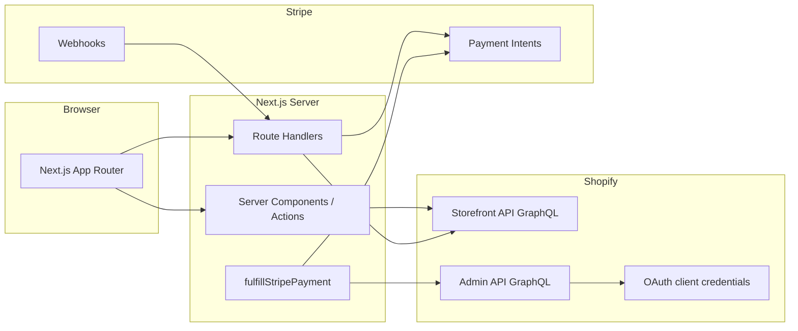
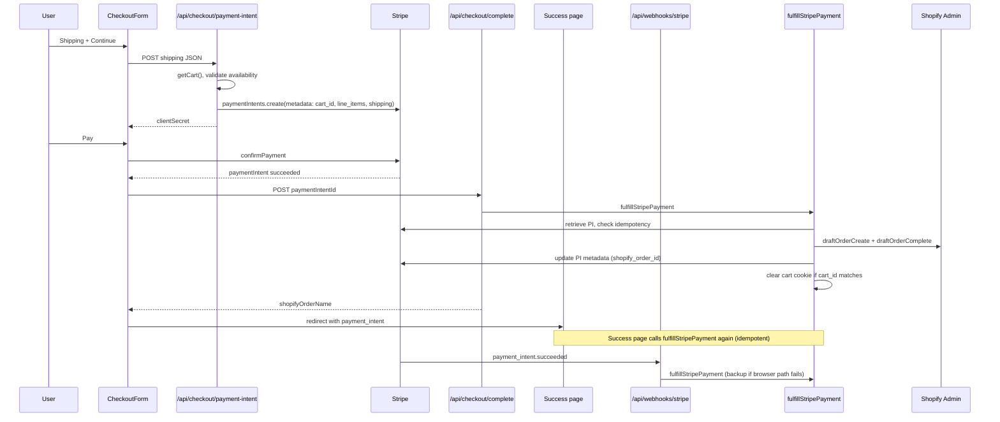

# Architecture

Headless Shopify storefront built with Next.js. Product browsing and cart use the **Shopify Storefront API**. Checkout runs on-site with **Stripe**; after payment succeeds, orders are created in Shopify via the **Admin API** (draft order → complete).

## System context



| System | Role |
|--------|------|
| **Shopify Storefront API** | Products, cart create/update, cart reads |
| **Shopify Admin API** | Draft order create + complete → real order |
| **Stripe** | Payment collection; metadata carries cart + shipping for fulfillment |
| **Next.js** | UI, server actions, API routes, cookie-backed cart session |

Shopify’s hosted checkout (`cart.checkoutUrl`) is not used. Payment happens in this app; Shopify only receives the order after Stripe confirms payment.

## Tech stack

| Layer | Choice |
|-------|--------|
| Framework | Next.js 16 (App Router) |
| UI | React 19, Tailwind CSS 4 |
| Language | TypeScript |
| Package manager | pnpm |
| Commerce read/write (catalog, cart) | Shopify Storefront API (`2024-10`) |
| Order creation | Shopify Admin API GraphQL (`2024-10`) |
| Payments | Stripe Payment Element + Payment Intents |

## Repository layout

```
app/
  page.tsx                    # Root redirect / landing
  layout.tsx                  # Root layout
  store/                      # Store segment (shared layout + header)
    layout.tsx                # Loads cart + shop name for header
    page.tsx                  # Product listing + filters
    [handle]/page.tsx         # Product detail
    cart/page.tsx             # Cart page
    checkout/page.tsx         # Checkout (server) + CheckoutForm (client)
    checkout/success/page.tsx # Post-payment confirmation + fulfillment retry
    actions/cart.ts           # Server actions: add / update / remove lines
  api/
    checkout/payment-intent/  # Create Stripe PaymentIntent from cart + shipping
    checkout/complete/        # Fulfill order after client-side payment success
    webhooks/stripe/          # Fulfill on payment_intent.succeeded (backup)

components/store/             # Store-specific UI (cards, cart, checkout form, header)

lib/
  shopify/                    # Storefront + Admin clients, cart, products, config
  stripe/                     # Stripe SDK + env helpers
  checkout/                   # Fulfillment, shipping validation, types, logging
```

Convention: **pages and server actions** live under `app/`; **integration and domain logic** lives under `lib/`.

## Runtime model

### Server Components (default)

Store pages are async Server Components. They call `lib/shopify` directly (no separate BFF layer). Product list responses are cached via `storefrontQuery` (`revalidate: 60`). Cart mutations use `storefrontMutation` with `cache: "no-store"`.

### Server Actions

`app/store/actions/cart.ts` wraps cart mutations (`addToCart`, `updateCartLine`, `removeCartLine`) and calls `revalidatePath` on `/store`, `/store/cart`, and `/store/checkout` so the layout header cart count and cart pages stay fresh.

### Client Components

Checkout uses Stripe’s client SDK (`@stripe/react-stripe-js`) in `components/store/checkout-form.tsx`:

1. Collect shipping → `POST /api/checkout/payment-intent`
2. Mount Payment Element with returned `clientSecret`
3. `stripe.confirmPayment` → on success, `POST /api/checkout/complete` → navigate to success page

### Cart session

Cart identity is stored in an **httpOnly cookie** (`shopify_cart_id`, 30-day max age). The value is the Shopify cart GID from Storefront API `cartCreate` / `cartLinesAdd`. Invalid or missing carts clear the cookie on read failure.

## Checkout and fulfillment flow



### PaymentIntent metadata

Created in `app/api/checkout/payment-intent/route.ts`:

| Key | Content |
|-----|---------|
| `cart_id` | Shopify cart GID (for cookie cleanup) |
| `line_items` | JSON array of `{ variantId, quantity }` |
| `shipping` | JSON `CheckoutShippingInput` (email, name, address) |

Amount and currency come from **`calculateCheckoutTotals`** (Shopify Admin `draftOrderCalculate`): **subtotal after discounts + tax**. See [checkout-tax.md](./checkout-tax.md). Example: $39.99 + $3.90 tax → **$43.89** charged in Stripe.

### Fulfillment (`lib/checkout/fulfillment.ts`)

Single entry point: `fulfillStripePayment(paymentIntentId)`.

1. Retrieve PaymentIntent from Stripe; require `status === "succeeded"`.
2. If `metadata.shopify_order_id` is set, return early (**idempotent**).
3. Parse `line_items` and `shipping` from metadata.
4. Admin GraphQL: `draftOrderCreate` → `draftOrderComplete`.
5. Write `shopify_order_id` / `shopify_order_name` back to PaymentIntent metadata.
6. Clear `shopify_cart_id` cookie when it matches `metadata.cart_id`.

**Three triggers** (by design, for reliability):

| Trigger | When |
|---------|------|
| `POST /api/checkout/complete` | Immediately after client-side `confirmPayment` succeeds |
| `/store/checkout/success` | Server render on redirect (handles return URL / retries) |
| `POST /api/webhooks/stripe` | `payment_intent.succeeded` (backup if browser never calls complete) |

Duplicate runs are safe: completed payments short-circuit on `shopify_order_id` in metadata.

## Shopify integration

### Storefront API (`lib/shopify/storefront.ts`)

- Endpoint: `https://{SHOPIFY_STORE_DOMAIN}/api/{version}/graphql.json`
- Auth: `X-Shopify-Storefront-Access-Token`
- Used for: `products`, `cart` queries and mutations

### Admin API (`lib/shopify/admin.ts`)

- Endpoint: `https://{SHOPIFY_STORE_DOMAIN}/admin/api/{version}/graphql.json`
- Auth: `X-Shopify-Access-Token` from `getAdminAccessToken()`
- Used for: draft order create/complete only (checkout fulfillment)

### Admin token resolution (`lib/shopify/access-token.ts`)

Two modes (checked via `hasShopifyAppCredentials()`):

1. **Static token** — `SHOPIFY_ADMIN_ACCESS_TOKEN` when app client id/secret are omitted.
2. **Client credentials** — `SHOPIFY_APP_CLIENT_ID` + `SHOPIFY_APP_CLIENT_SECRET` → OAuth `client_credentials` grant; token cached in memory with expiry buffer.

Fulfillment requires Admin scopes such as `write_draft_orders` and product read access.

## Stripe integration

| File | Purpose |
|------|---------|
| `lib/stripe/server.ts` | Server-side Stripe SDK singleton |
| `lib/stripe/config.ts` | `STRIPE_SECRET_KEY`, `STRIPE_WEBHOOK_SECRET`, `NEXT_PUBLIC_STRIPE_PUBLISHABLE_KEY` |

Webhook handler verifies `stripe-signature` with `STRIPE_WEBHOOK_SECRET` before processing.

## Routes map

| Path | Type | Responsibility |
|------|------|----------------|
| `/` | Page | App entry |
| `/store` | Page | Product grid; `?type=` filter by `product_type` |
| `/store/[handle]` | Page | Product detail + add to cart |
| `/store/cart` | Page | Cart lines, quantity updates, remove |
| `/store/checkout` | Page | Checkout shell; empty cart → redirect to cart |
| `/store/checkout/success` | Page | Order confirmation; fulfillment on load |
| `/api/checkout/payment-intent` | POST | Create PaymentIntent |
| `/api/checkout/complete` | POST | Fulfill by `paymentIntentId` |
| `/api/webhooks/stripe` | POST | Stripe webhook → fulfillment |

## Environment variables

See `.env.example`. Required groups:

| Group | Variables | Used for |
|-------|-----------|----------|
| Shopify store | `SHOPIFY_STORE_DOMAIN` | All Shopify API calls |
| Storefront | `SHOPIFY_STOREFRONT_ACCESS_TOKEN` | Products, cart |
| Admin | `SHOPIFY_ADMIN_ACCESS_TOKEN` **or** `SHOPIFY_APP_CLIENT_ID` + `SHOPIFY_APP_CLIENT_SECRET` | Order fulfillment |
| Stripe | `NEXT_PUBLIC_STRIPE_PUBLISHABLE_KEY`, `STRIPE_SECRET_KEY`, `STRIPE_WEBHOOK_SECRET` | Checkout + webhooks |

Optional: `PORT` for local dev.

## Observability

Checkout and Admin calls emit structured logs via `lib/checkout/logger.ts` (`logCheckout`, `logCheckoutError`) with event names such as `fulfillment_start`, `draft_order_create_ok`, `webhook_fulfillment_failed`. Search server logs by `paymentIntentId` or operation name when debugging failed fulfillments.

## Security notes

- Storefront and Admin tokens are **server-only** (never exposed to the browser).
- Cart cookie is httpOnly; `secure` in production.
- Stripe webhook signatures are verified before handling.
- PaymentIntent amount is computed server-side from the cart, not from client input.
- Shipping fields are validated in `lib/checkout/validate-shipping.ts` before creating a PaymentIntent.

## Local development

1. `pnpm dev` — app (default port 3000, or `PORT` from env).
2. `stripe listen --forward-to localhost:{port}/api/webhooks/stripe` — webhook signing secret into `STRIPE_WEBHOOK_SECRET`.

See [README.md](../README.md) for setup, test cards, and scope requirements.

## Extension points

| Change | Likely touch points |
|--------|---------------------|
| New product filters | `lib/shopify/products.ts`, `lib/shopify/filters.ts`, `components/store/store-filters.tsx` |
| Cart behavior | `lib/shopify/cart.ts`, `app/store/actions/cart.ts` |
| Checkout fields / validation | `lib/checkout/types.ts`, `validate-shipping.ts`, `checkout-form.tsx` |
| Order creation logic | `lib/checkout/fulfillment.ts` (e.g. tags, discounts, inventory) |
| Alternative payment methods | `payment-intent/route.ts`, Stripe Dashboard + Element config |

## Design decisions (summary)

1. **Headless storefront** — Full control of UX; Shopify is system of record for catalog and fulfilled orders.
2. **Stripe on-site, not Shopify Checkout** — Payment UX and PSP are decoupled from Shopify’s checkout URL.
3. **Draft order fulfillment** — Maps paid Stripe intents to Shopify orders without Storefront `checkoutComplete`.
4. **Redundant fulfillment paths** — Browser complete + success page + webhook reduce lost orders if one path fails.
5. **Idempotent fulfillment** — `shopify_order_id` on PaymentIntent metadata prevents duplicate Shopify orders.
