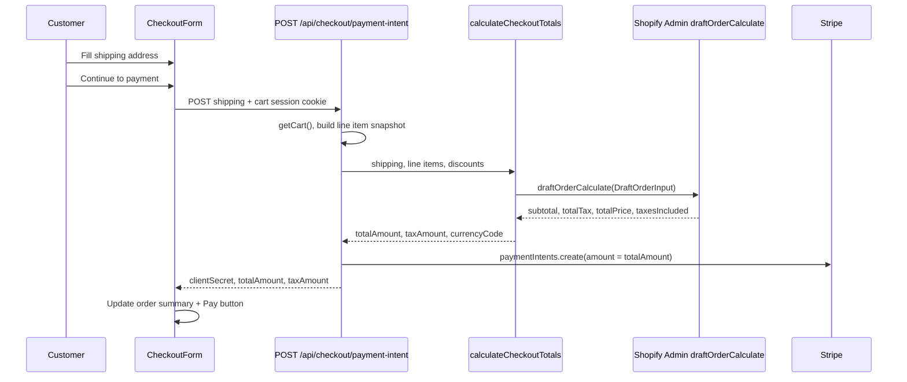

# Checkout tax

How sales tax is calculated, displayed, and charged in this headless storefront.

## Summary

| Question | Answer |
|----------|--------|
| Who calculates tax? | **Shopify Admin** via `draftOrderCalculate` |
| When is tax known? | After the customer submits a **shipping address** at checkout |
| What is charged in Stripe? | **Subtotal after discounts + tax** (e.g. $39.99 + $3.90 = **$43.89**) |
| Where are tax rules configured? | **Shopify Admin → Settings → Taxes** (not in this repo) |
| Does the cart page show tax? | No — only a note that tax is calculated at checkout |

Tax is **not** hard-coded in the app (no fixed CA rate in code). Rates, nexus, and product taxability all come from Shopify.

---

## Why not the Storefront Cart API?

This app uses Shopify’s **Storefront API** for catalog and cart. That API is **not reliable for tax** in a custom Stripe checkout:

1. **`Cart.cost.totalTaxAmount` is deprecated** (removed from current CartCost docs as of API `2025-01`).
2. In practice it often returns **`null`**, and `totalAmount` equals the pre-tax line total even when a delivery address is set.
3. Shopify’s direction is to finalize tax at **checkout** with full buyer context, not on the cart object.

We tested this directly: a cart with a California delivery address still returned `totalTaxAmount: null` and no tax in `totalAmount`.

**Rule:** Do not use `cart.cost.totalTaxAmount` or `computeCartTaxAmount(cart)` as the source of truth for charging customers. Those helpers remain for optional display fallbacks only.

---

## How tax is implemented

### High-level flow



Tax is computed **once**, at payment-intent creation, using the same draft-order shape as post-payment fulfillment (`draftOrderCreate`).

### Source of truth: `draftOrderCalculate`

File: `lib/checkout/calculate-checkout-totals.ts`

The Admin mutation builds a **preview draft order** with:

- Customer email (and optional `customerId` for active members)
- Line items from the cart snapshot (`buildDraftOrderLineItemInput`)
- Membership / voucher discounts (`buildOrderLevelAppliedDiscount`)
- Shipping and billing address (`provinceCode`, `countryCode`, `zip`, etc.)

It reads back:

| Field | Use |
|-------|-----|
| `subtotalPriceSet` | Reference subtotal from Shopify |
| `totalTaxSet` | **Tax line** shown in UI |
| `totalPriceSet` | **Amount charged in Stripe** |
| `taxesIncluded` | Whether tax is embedded in line prices |

### Tax-exclusive checkout (`CHECKOUT_TAXES_INCLUDED = false`)

File: `lib/checkout/draft-order-lines.ts` sets `CHECKOUT_TAXES_INCLUDED = false`. The app treats cart line prices as **pre-tax** and charges **subtotal + tax** in Stripe.

Shopify’s Admin API does **not** let you override `taxesIncluded` on `DraftOrderInput` (API `2024-10`). The flag comes from **Shopify Admin → Settings → Taxes** (“prices include tax”). When the shop still has tax-inclusive prices:

1. `draftOrderCalculate` returns embedded tax in `totalTaxSet` and a `totalPriceSet` that does **not** add tax on top.
2. `calculateCheckoutTotals` derives an effective rate from Shopify’s subtotal/tax and applies it to the customer-facing post-discount subtotal (`computeCartPostDiscountSubtotal` from the Storefront cart).
3. Stripe is charged `postDiscountSubtotal + tax`.

When the shop is configured tax-exclusive in Admin, Shopify’s tax amount is used directly and added to the subtotal.

```typescript
// lib/checkout/calculate-checkout-totals.ts — resolveTaxExclusiveTotals()
if (options.taxesIncluded && shopifySubtotal > 0 && shopifyTax > 0) {
  const effectiveRate = shopifyTax / shopifySubtotal;
  tax = roundMoney(taxableSubtotal * effectiveRate);
}
if (!CHECKOUT_TAXES_INCLUDED) {
  total = roundMoney(taxableSubtotal + tax);
}
```

### Stripe charge

File: `app/api/checkout/payment-intent/route.ts`

- `amount = round(totalAmount × 100)` cents
- `metadata.tax_amount` stores the tax string for auditing
- Response includes `totalAmount`, `taxAmount`, `currencyCode` for the client UI

### UI display

| Page | Tax behavior |
|------|----------------|
| **Cart** (`/store/cart`) | Shows: *“Tax calculated at checkout based on your shipping address.”* Total is pre-tax (membership/voucher discounts only). |
| **Checkout shipping step** | Same note in order summary sidebar. |
| **Checkout payment step** | After **Continue to payment**, sidebar shows a **Tax** line and updated **Total**; Pay button uses the new total. |

Components:

- `components/store/cart-totals-summary.tsx` — subtotal, discounts, tax line or note, total
- `components/store/checkout-form.tsx` — calls payment-intent, passes totals to parent via `onCheckoutTotals`
- `components/store/checkout-page-client.tsx` — holds `checkoutTaxAmount` / `checkoutTotalAmount` overrides for the sidebar

Props on `CartTotalsSummary`:

| Prop | Purpose |
|------|---------|
| `showTaxCalculatedAtCheckout` | Show the “calculated at checkout” note when tax is still unknown |
| `taxAmountOverride` | Tax from payment-intent response (checkout only) |
| `totalAmountOverride` | Total from payment-intent response (checkout only) |

### Fulfillment alignment

After payment, `lib/checkout/fulfillment.ts` creates a real draft order with the **same** line items, discounts, and shipping address. Shopify applies tax again on that order. Because we use the same inputs as `draftOrderCalculate`, the **Stripe charge and Shopify order total should match**.

---

## Business rules (app behavior)

1. **Tax requires a shipping address.** Province/state and ZIP are required fields (`lib/checkout/validate-shipping.ts`). Tax is $0 until an address is submitted at checkout.

2. **Supported countries in the form:** `US` and `CA` only (`components/store/checkout-form.tsx`). Tax for other regions is not exposed in the UI even if Shopify supports them.

3. **Which states/provinces are taxed** is entirely defined in **Shopify Admin**, not in code. Example: if only California is configured, a New York address returns **$0 tax**; a Los Angeles address returns CA tax.

4. **Membership and promo discounts** are applied **before** tax in the draft-order calculation (same as fulfillment).

5. **Tax-exclusive checkout (default).** `CHECKOUT_TAXES_INCLUDED = false` in `lib/checkout/draft-order-lines.ts`. Line prices are treated as **pre-tax**; tax is **added on top** at checkout. Stripe charges `postDiscountSubtotal + tax`. If Shopify Admin still has “prices include tax” enabled, the app derives tax from Shopify’s rate and adds it to the cart subtotal for charging.

6. **Cart Storefront totals are not updated for tax.** The cart cookie and Storefront cart total stay pre-tax until checkout recalculates via Admin.

---

## Shopify Admin setup

Configure tax in the Shopify store (not in this repository):

1. **Settings → Taxes and duties**
   - Enable collection for the regions you ship to (e.g. United States → California).
   - Confirm products are **taxable** (product/variant tax settings).

2. **Tax registration / nexus**
   - Add registrations for states where you collect (e.g. CA).

3. **Prices include tax or not** (**required for alignment**)
   - Turn **off** “All prices include tax” / “Include sales tax in product prices and shipping rates”.
   - Verify via Admin API: `shop { taxesIncluded }` should return `false`.
   - When this is **on**, Shopify order tax lines show **Included** and the order total equals the line subtotal (tax embedded). Stripe may still charge subtotal + tax if `CHECKOUT_TAXES_INCLUDED = false`, causing a **mismatch**.
   - When this is **off**, tax is a separate line on orders and totals match Stripe.

4. **Admin API access**
   - `draftOrderCalculate` requires Admin scope **`write_draft_orders`** (same family as order fulfillment).
   - The app’s OAuth client credentials path must include this scope; a static admin token without it will fail tax calculation.

---

## Code map

| File | Role |
|------|------|
| `lib/checkout/calculate-checkout-totals.ts` | Admin `draftOrderCalculate`; returns tax + total |
| `app/api/checkout/payment-intent/route.ts` | Orchestrates cart → totals → Stripe PaymentIntent |
| `lib/checkout/draft-order-lines.ts` | Shared line items + discount inputs for calculate & fulfill |
| `lib/checkout/cart-checkout.ts` | Builds `CheckoutLineItemMeta[]` snapshot from cart |
| `lib/checkout/fulfillment.ts` | Creates completed Shopify order after payment |
| `lib/shopify/cart-tax.ts` | **Fallback only** — derives tax from cart cost if present |
| `lib/shopify/cart.ts` | `applyCartDeliveryAddress()` — Storefront delivery address helpers (not used for charging) |
| `components/store/cart-totals-summary.tsx` | Renders tax line or “calculated at checkout” note |

---

## Verified example (tax-exclusive)

Tested on **Jul 3, 2026** after disabling “prices include tax” in Shopify Admin (`shop.taxesIncluded: false`).

**Product:** Grass-Fed Protein Bars (12pk) — Peanut Butter Chocolate Chip  
**Shipping:** 123 Main Street, Los Angeles, CA 90001, US  
**Shopify order:** MLPA-1362

| Line | Amount |
|------|--------|
| Subtotal | $39.99 |
| Tax (CA) | $3.90 |
| **Total charged (Stripe + Shopify)** | **$43.89** |

Payment-intent API response:

```json
{
  "totalAmount": "43.89",
  "taxAmount": "3.90",
  "currencyCode": "USD"
}
```

Stripe PaymentIntent amount: **4389** cents. Success page and Shopify Admin both show **Paid $43.89**. Tax lines on the Shopify order are **added** (not labeled “Included”).

### Before vs after (same product, CA address)

| Setting | Example order | Subtotal | Tax | Total paid |
|---------|---------------|----------|-----|------------|
| Tax-inclusive (Admin “prices include tax” **on**) | MLPA-1360 | $36.00* | ~$3.20 shown as **Included** | **$36.00** |
| Tax-exclusive (Admin “prices include tax” **off**) | MLPA-1362 | $39.99 | **+$3.90** | **$43.89** |

\*MLPA-1360 included a membership discount ($39.99 → $36.00). MLPA-1362 was tested without an active membership session (full list price $39.99). Discounts still apply before tax in both modes.

### Formula

```
totalAmount = postDiscountSubtotal + taxAmount
```

Example: `$39.99 + $3.90 = $43.89`

---

## Testing

### Manual (local)

1. Confirm Shopify Admin has **“prices include tax” turned off** (`shop.taxesIncluded: false`).
2. Add a taxable product to cart.
3. Go to `/store/checkout`.
4. Enter a **California** address (e.g. Los Angeles, CA 90001).
5. Click **Continue to payment**.
6. Confirm order summary shows **Tax** (e.g. ~$3.90 on a $39.99 item) and **Total** = subtotal + tax (e.g. **$43.89**).
7. Pay button amount must match the total.
8. After payment, confirm Shopify order **Paid** equals the Stripe charge (not the pre-tax subtotal alone).

Compare with a **non-tax state** (e.g. NY if only CA is configured): tax line should be hidden and total unchanged from cart.

### API check

```bash
curl -s -X POST http://localhost:3001/api/checkout/payment-intent \
  -H 'Content-Type: application/json' \
  -H 'Cookie: shopify_cart_id=...' \
  -d '{
    "email": "test@example.com",
    "firstName": "Test",
    "lastName": "User",
    "address1": "123 Main Street",
    "city": "Los Angeles",
    "province": "CA",
    "zip": "90001",
    "country": "US"
  }'
```

Expected JSON includes `taxAmount`, `totalAmount`, `clientSecret`. For a ~$40 taxable item shipped to CA, expect tax around **$3.90** and total around **$43.89** (exact amounts depend on product price and Shopify tax rules).

Example:

```json
{
  "totalAmount": "43.89",
  "taxAmount": "3.90",
  "currencyCode": "USD",
  "clientSecret": "pi_..._secret_..."
}
```

---

## Troubleshooting

| Symptom | Likely cause |
|---------|----------------|
| Tax always $0 | No tax region matches address in Shopify Admin; product not taxable; or missing `write_draft_orders` scope |
| Pay amount ≠ order summary total | Client didn’t receive `onCheckoutTotals` callback; hard-refresh checkout |
| Stripe charged $43.89 but Shopify order shows $36.00 paid | Shopify Admin still has **“prices include tax”** enabled — tax is embedded in line prices on the order |
| Shopify tax lines say **Included** | Same — turn off “prices include tax” in Admin |
| Tax shown but total unchanged | Stale checkout session — go back and continue again; ensure `CHECKOUT_TAXES_INCLUDED` is `false` |
| NY address, no tax | Expected if tax is configured **only for California** |
| `draftOrderCalculate` access denied | Admin token missing `write_draft_orders`; use OAuth client credentials with correct scopes |
| Storefront `totalTaxAmount` null | Expected — do not rely on Storefront cart for tax |

---

## Related docs

- [architecture.md](./architecture.md) — overall checkout and fulfillment flow
