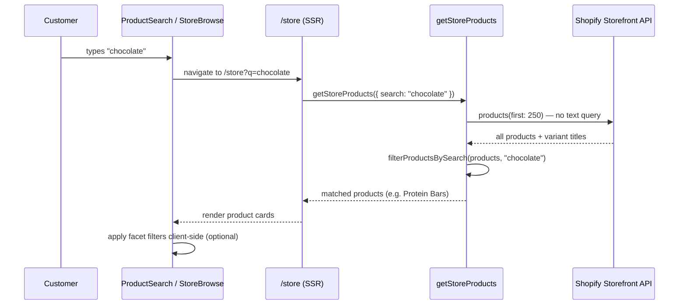

# Product variant search

How text search works on `/store`, including matching **variant titles** (for example, finding *Grass-Fed Protein Bars* when the customer searches `chocolate`).

## Summary

| Question | Answer |
|----------|--------|
| Where is search entered? | Search box on `/store` (`components/store/product-search.tsx`) |
| How is the term stored? | URL query param `?q=...` (shareable, bookmarkable) |
| Who filters results? | **This app** — client-side filter after loading products from Shopify |
| Does Shopify `products(query:)` search variants? | **Not reliably** on the Storefront API |
| What fields are matched? | Product title, description, vendor, product type, tags, and **all variant titles** |
| Pagination during search? | **No** — full catalog is loaded once, then filtered |
| Works with sidebar filters? | **Yes** — facet filters apply on top of search results |

**Rule:** Do not depend on Storefront `products(query: "variant_title:…")` for variant search. Fetch variant titles in the product list query and filter in application code.

---

## The problem

Many products in this catalog have meaningful variant titles (flavors, sizes, formats). Example:

| Product | Variant titles |
|---------|----------------|
| Grass-Fed Protein Bars (12pk) | `Dark Almond Chocolate`, `Chocolate Sea Salt Brownie`, `Peanut Butter Chocolate Chip`, … |
| 100% Grass-Fed WPI (2 LB) | `Milk Chocolate`, `Chocolate Peanut Butter`, `Mint Chocolate Chip`, … |

Customers expect to search `chocolate` or `peanut butter` and see the parent product, even when those words appear only on a variant — not in the product title.

### What we tried first (and why it failed)

An early implementation pushed the search term into Shopify’s `products` query:

```graphql
products(first: 24, query: "(title:*chocolate* OR variant_title:*chocolate* OR vendor:*chocolate* OR tag:*chocolate*)") {
  ...
}
```

This approach failed in practice:

1. **Parentheses + multi-field OR queries often return zero results** on the Storefront API (for example `peanut butter`, `chocolate`).
2. **`variant_title:*chocolate*` alone is unreliable** — it can return unrelated products (test panels with `Default Title`) and miss real matches (protein bars with chocolate variants).
3. **Unqualified search** (`query: "chocolate"`) matches some products by title/vendor but **misses** products where only a variant title contains the term.
4. The Storefront **`search` query** also did not return protein bars for `chocolate` alone in our tests.

The Admin API supports `variant_title` filtering more explicitly, but this app’s Admin token is scoped for orders/checkout — not catalog reads.

---

## The solution

When `?q=` is present:

1. **Load the full catalog** from the Storefront API (paginated server-side in batches of 250).
2. **Include variant titles** in the list query (`variants(first: 20) { title }`).
3. **Filter in app code** with `filterProductsBySearch()`.
4. **Return all matches in one response** (`hasNextPage: false`) — no infinite scroll during search.

When `?q=` is absent, behavior is unchanged: paginated listing with infinite scroll.



---

## Implementation guide

### 1. Fetch variant titles in the product list query

The listing query must return more than the first variant. Update `PRODUCT_CARD_FIELDS` in `lib/shopify/products.ts`:

```graphql
variants(first: 20) {
  edges {
    node {
      id
      title
      availableForSale
    }
  }
}
```

Normalize list nodes so `StoreProduct.variants[].title` is preserved (do not hard-code `"Default Title"` for cards).

### 2. Add a search filter function

`filterProductsBySearch()` in `lib/shopify/products.ts` performs a case-insensitive substring match across:

- `product.title`
- `product.description`
- `product.vendor`
- `product.productType`
- `product.tags[]`
- `product.variants[].title` ← **variant search**

```typescript
export function filterProductsBySearch(
  products: StoreProduct[],
  search: string | null | undefined,
): StoreProduct[] {
  const query = search?.trim().toLowerCase();
  if (!query) return products;

  return products.filter((product) => {
    // ...title, vendor, tags, etc.
    return product.variants.some((variant) =>
      variant.title.toLowerCase().includes(query),
    );
  });
}
```

### 3. Load full catalog when searching

`getStoreProducts()` branches on `search`:

```typescript
if (search) {
  const { products, shopName, shopUrl } = await fetchAllStoreProducts(productType);
  return {
    products: filterProductsBySearch(products, search),
    pageInfo: { hasNextPage: false, endCursor: null },
    // ...
  };
}
```

`fetchAllStoreProducts()` loops `products(first: 250, after: $cursor)` until `hasNextPage` is false.

### 4. Wire the URL param through the stack

| Layer | Responsibility |
|-------|----------------|
| `lib/shopify/filters.ts` | `parseProductSearch()`, preserve `q` in `buildStoreSearchParams()` / `buildStoreQueryParams()` |
| `app/store/page.tsx` | Read `?q=`, pass `search` to `getStoreProducts()`, remount `StoreBrowse` when `q` changes |
| `app/api/store/products/route.ts` | Accept `q` and delegate to `getStoreProducts({ search: q })` |
| `components/store/product-search.tsx` | Debounced input → `router.push("/store?q=...")` |
| `components/store/store-browse.tsx` | Apply `filterProductsBySearch()` before facet filters in `useMemo` |
| `components/store/store-filters.tsx` | Keep `q` when toggling facet filters; clear filters without clearing search |

### 5. Combine search with facet filters

Search and facets are **independent layers**:

1. **Search** (server + client): narrows by text, including variants.
2. **Facets** (client): further narrow by product type, goal tags, brand, etc.

Order in `StoreBrowse`:

```typescript
const filteredProducts = useMemo(() => {
  const searched = filterProductsBySearch(products, searchQuery);
  return filterStoreProducts(searched, active);
}, [products, active, searchQuery]);
```

Facet counts are built from search-filtered products so counts stay accurate.

---

## Key files

| File | Role |
|------|------|
| `lib/shopify/products.ts` | GraphQL fields, `fetchAllStoreProducts`, `filterProductsBySearch`, `getStoreProducts` |
| `lib/shopify/filters.ts` | `parseProductSearch`, URL helpers that preserve `q` |
| `app/store/page.tsx` | SSR entry — reads `?q=` |
| `app/api/store/products/route.ts` | JSON API for product loading |
| `components/store/product-search.tsx` | Search input UI |
| `components/store/store-browse.tsx` | Results grid, combined search + facet filtering |
| `components/store/store-filters.tsx` | Sidebar filters compatible with active search |

---

## Examples

| Search term | Expected match | Why |
|-------------|----------------|-----|
| `chocolate` | Grass-Fed Protein Bars (12pk) | Variants include `Dark Almond Chocolate`, `Chocolate Sea Salt Brownie`, … |
| `peanut butter` | Grass-Fed Protein Bars (12pk), WPI products | Variants include `Peanut Butter Chocolate Chip`, `Chocolate Peanut Butter`, … |
| `protein bar` | Grass-Fed Protein Bars (12pk) | Matches product title |
| `Dark Almond Chocolate` | Grass-Fed Protein Bars (12pk) | Exact variant title match |

Manual test URLs:

- `/store?q=chocolate`
- `/store?q=peanut+butter`
- `/store?q=chocolate&type=Protein` (search + facet)

---

## Trade-offs and limits

### Catalog size

This store has ~120 products, so loading the full catalog on each search is fast (one or two Storefront requests).

If the catalog grows significantly (thousands of products):

- Consider caching the full product list server-side with a short TTL.
- Or move search to a dedicated index (Algolia, Shopify Admin API with product read scope, etc.).
- Or use Shopify’s `predictiveSearch` for autocomplete only and keep full browse separate.

### Variant cap

The list query fetches `variants(first: 20)`. Products with more than 20 variants may not expose every title to the filter. Raise the limit or paginate variants if that becomes an issue.

### Search semantics

Matching is **substring, case-insensitive** — not fuzzy, not word-stemmed, not ranked by relevance. `choc` will not match `chocolate`.

### Admin API

`variant_title` filtering works on the Admin GraphQL API, but requires `read_products` scope. This app’s Admin integration is checkout-focused; catalog search stays on Storefront + app-side filtering.

---

## What not to do

| Approach | Problem |
|----------|---------|
| `products(query: "(title:*term* OR variant_title:*term*)")` | Often returns **zero results** on Storefront API |
| Server-only `variant_title:*term*` | Unreliable; wrong products or missed matches |
| Client filter without variant titles in GraphQL | Cannot match variant-only terms |
| Infinite scroll during search | User may never load the page containing the match |
| Rely on `cart` or `search` Storefront queries for catalog browse | Different use cases; `search` missed variant-only matches in our tests |

---

## Extending search

### Match more fields

Add checks inside `filterProductsBySearch()` (for example `handle`, SKU if added to the list query).

### Search ranking

Post-process matches: exact title match first, then variant match, then description/tag match.

### Autocomplete

Add a separate `predictiveSearch` Storefront query and dropdown UI. Keep full results on `/store?q=` using the approach documented here.

### SKU / barcode search

Extend `PRODUCT_CARD_FIELDS` with `variants { sku }` (if exposed on Storefront) and add a field check in `filterProductsBySearch()`.

---

## Related docs

- [docs/architecture.md](./architecture.md) — overall app structure
- [Shopify Storefront `products` query](https://shopify.dev/docs/api/storefront/latest/queries/products) — official API reference (note limited `query` filter fields)
